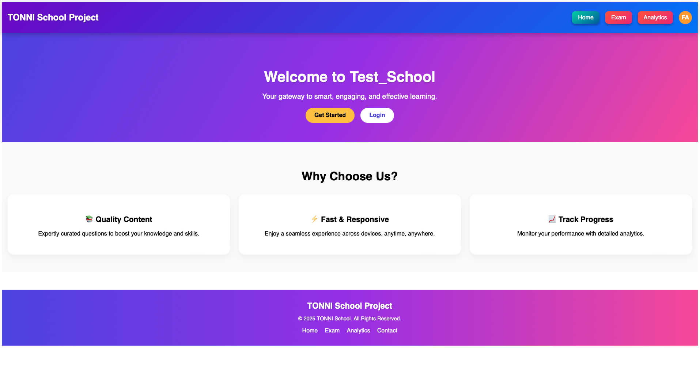
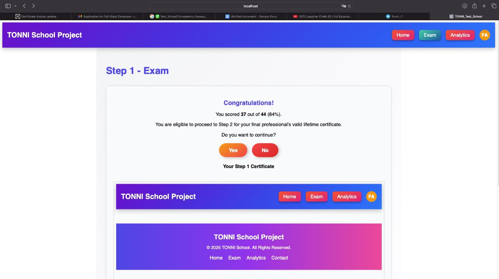
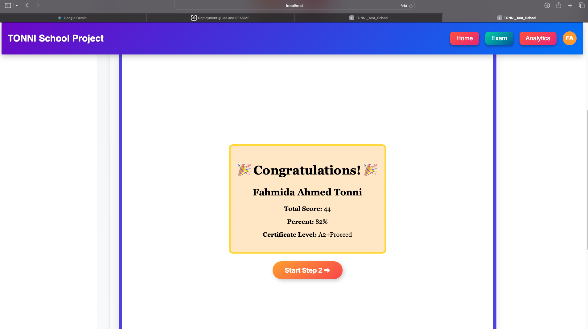
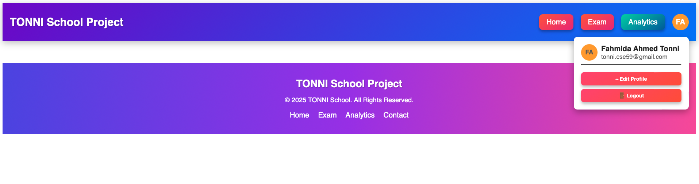

# 🎓 TONNI Test School

An interactive online examination platform with multiple steps, auto-generated certificates, and secure authentication.  
Deployed with **Render (Backend)** and **Vercel (Frontend)**.

---

## 🌐 Live Demo
- **Frontend:** https://test-school-tonni.vercel.app
- **Backend API:** https://test-school-tonni.onrender.com

---

## 📸 Screenshots

### 🏠 Home Page


### 📖 Exam Page


### 🎖 Certification Page


### 🔑 Login Page


---

## 🚀 Features
- **Multi-step exam system** with eligibility checks  
- **Automatic certificate generation** after completion  
- **Secure user authentication** (JWT)  
- **MongoDB Atlas** cloud database integration  
- Fully responsive UI with modern design

---

## ⚙️ Tech Stack
**Frontend**:
- React + TypeScript
- Redux Toolkit
- Tailwind CSS

**Backend**:
- Node.js + Express.js
- MongoDB Atlas
- JWT Authentication

---

## 📦 Installation & Local Development

### Clone repo
```bash
git clone https://github.com/tonni59/TONNI_Test_School.git
cd TONNI_Test_School
